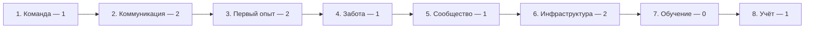

# Профиль развития юнита

Профиль показывает, где юнит находится сейчас и что является ближайшим шагом. Он нужен, чтобы секретарь и команда видели картину целиком и не тратили силы на то, что сейчас не главное.

!!! note "Как пользоваться"
    Пройдите по восьми направлениям и отметьте честную стадию по каждому. Ориентируйтесь на то, что происходит **регулярно**, а не на разовые случаи.

## Восемь направлений

| № | Направление | Что показывает |
| --- | --- | --- |
| 1 | Команда и управление | Кто держит работу и как распределены функции |
| 2 | Коммуникация и привлечение | Как люди узнают о юните и выходят на контакт |
| 3 | Первый опыт и регулярные программы | Что человек получает, когда приходит впервые |
| 4 | Забота и путь человека | Что происходит после первой встречи |
| 5 | Сообщество и служение | Есть ли у людей принадлежность и общее дело |
| 6 | Инфраструктура | Помещение, оборудование, каналы связи |
| 7 | Обучение и качество | Умеет ли команда то, что делает |
| 8 | Учёт, показатели и обратная связь | Видно ли, что меняется, и доходит ли опыт до Центра |

## Четыре стадии

| Стадия | Название | Признак |
| --- | --- | --- |
| 0 | Отсутствует | Направление не ведётся |
| 1 | Рабочий минимум | Что-то делается, но нерегулярно и держится на одном человеке |
| 2 | Регулярно и устойчиво | Работа идёт постоянно, есть понятный порядок, не зависит от одного человека |
| 3 | Развито и измеряется | Есть результат в цифрах, свои материалы, опыт можно передать другим |

!!! warning "Не выводите средний балл"
    Один общий балл скрывает главное — где юнит силён и что его ограничивает. Смотрите на профиль целиком: сильные направления опираются на слабое, и именно слабое обычно тормозит всё остальное.

## Как выглядит профиль

Пример профиля небольшого юнита:

Чтение профиля: команда и забота отстают, обучение не ведётся. Ближайший шаг — не реклама, а забота: без второго прихода привлечение тратится впустую.

## Ориентиры по направлениям

Ниже — наблюдаемые признаки по стадиям. Они помогают договориться о словах и не спорить о формулировках.

### 1. Команда и управление

| Стадия | Признак |
| --- | --- |
| 0 | Нет человека, который держит работу |
| 1 | Есть один ведущий; функции распределяются по ситуации |
| 2 | Есть 2–3 помощника с понятными зонами: программа, анонсы, пространство, учёт |
| 3 | Роли закреплены, есть замена на случай отсутствия, решения фиксируются |

### 2. Коммуникация и привлечение

| Стадия | Признак |
| --- | --- |
| 0 | Люди приходят случайно |
| 1 | Есть канал и чат; анонсы выходят нерегулярно |
| 2 | Анонсы выходят по расписанию, есть постоянный канал и понятная информация для новичка |
| 3 | Работает несколько источников, видно, откуда приходят люди |

### 3. Первый опыт и регулярные программы

| Стадия | Признак |
| --- | --- |
| 0 | Встречи не проводятся |
| 1 | Встречи бывают, подготовка зависит от настроения |
| 2 | Есть регулярная коллективная практика по стандарту, новичка встречают |
| 3 | Стандарт выполняется стабильно, есть разбор после программы и улучшения |

### 4. Забота и путь человека

| Стадия | Признак |
| --- | --- |
| 0 | После встречи никто не пишет |
| 1 | Отвечают тем, кто сам написал |
| 2 | Есть контакт после первой встречи, человека ведут к следующему шагу |
| 3 | Видно путь каждого человека и переходы между этапами |

### 5. Сообщество и служение

| Стадия | Признак |
| --- | --- |
| 0 | Люди приходят только на практику и не знают друг друга |
| 1 | Есть общий чат и чаепитие после программ |
| 2 | Есть совместные активности помимо практики, люди знакомы между собой |
| 3 | Есть регулярное служение и проекты, которые ведут сами участники |

### 6. Инфраструктура

| Стадия | Признак |
| --- | --- |
| 0 | Нет места для встреч |
| 1 | Встречи проходят на дому или в разово арендуемом помещении |
| 2 | Есть постоянное помещение с базовыми удобствами и настроенным оборудованием |
| 3 | Есть своё пространство, инвентарь и запас на развитие |

### 7. Обучение и качество

| Стадия | Признак |
| --- | --- |
| 0 | Никто специально не учится |
| 1 | Участники смотрят материалы и перенимают опыт друг у друга |
| 2 | Команда прошла базовое обучение и знает стандарты программ |
| 3 | Есть свой план обучения, наставничество и подготовка новых ведущих |

### 8. Учёт, показатели и обратная связь

| Стадия | Признак |
| --- | --- |
| 0 | Ничего не записывается |
| 1 | Ведутся списки людей и отметки посещений |
| 2 | Считаются основные показатели, результаты обсуждаются с командой |
| 3 | Показатели сравниваются с целями, гипотезы проверяются, опыт уходит в Центр |

## Что делать с профилем

1. Определите стадию по каждому направлению на сегодня.
2. Найдите **ближайшее ограничение** — направление, которое тормозит остальные.
3. Выберите **один шаг** на 2–4 недели, который поднимает именно его.
4. Повторите профиль через месяц и сравните.

Показатели для целей описаны в [системе показателей](../10_Метрики/Система_показателей.md).

## Статус

Профиль собран на основе методички для представителей и переработан под систему Прачары: вместо общего рейтинга из 12 уровней используется компактный профиль по восьми направлениям и четырём стадиям.

Часть признаков из источника описывает масштаб и ресурсы города, а не движение людей к практике. Такие признаки **не считаются обязательной нормой** для малого юнита: большой центр — не цель сама по себе.

!!! note "ТРЕБУЕТ РЕШЕНИЯ"
    Обязательность отдельных признаков, требования к статусам и обучению команды утверждаются отдельно. До решения профиль используется как рабочий ориентир.
