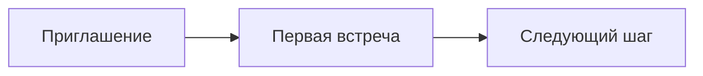

# Оформление материалов

Пишите содержание в Markdown внутри `docs/`. Изображения храните в `docs/assets/images/`, а ссылки делайте относительными к файлу страницы. Все примеры ниже собираются средствами MkDocs Material.

## Изображения и инфографики

Поместите файл, например `docs/assets/images/путь-человека.png`, в папку изображений и вставьте его так:

```md

```

Для схем, которые удобно менять вместе с текстом, используйте Mermaid:

````md

````

## Чек-листы и таблицы

- [ ] Уточнить, для кого материал.
- [ ] Проверить следующий шаг человека.
- [ ] Добавить ссылку на связанный документ.

| Вопрос | Что зафиксировать |
| --- | --- |
| Для кого? | Роль или этап пути |
| Что делать? | Конкретное действие |
| Что дальше? | Ссылка на следующий материал |

## Выделенные блоки

!!! tip "Перед публикацией"
    Проверьте смысл, согласованность с соседними документами и все внутренние ссылки.

Синтаксис блока:

```md
!!! note "Важно"
    Короткое уточнение, которое стоит заметить отдельно.
```

## Кнопки и карточки

[Открыть каталог программ](../08_Программы/Каталог_программ.md){ .md-button .md-button--primary }

Для подборки ссылок используйте карточки:

```md
<div class="grid cards" markdown>

- **Название направления**

  Короткое описание.

  [Открыть](../08_Программы/Каталог_программ.md)

</div>
```

После добавления страницы внесите её в `nav` файла `mkdocs.yml` и выполните `mkdocs build --strict`.
